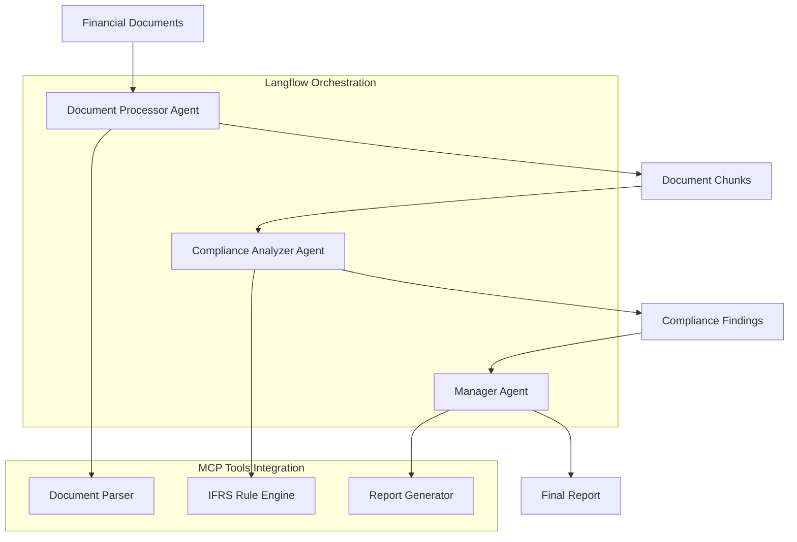
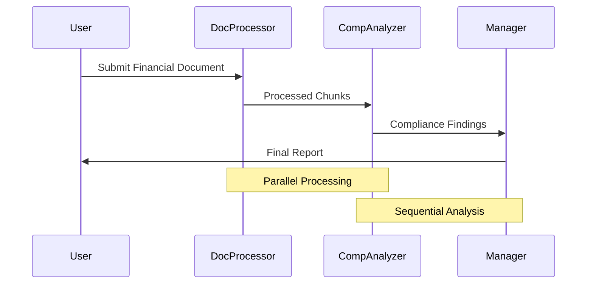
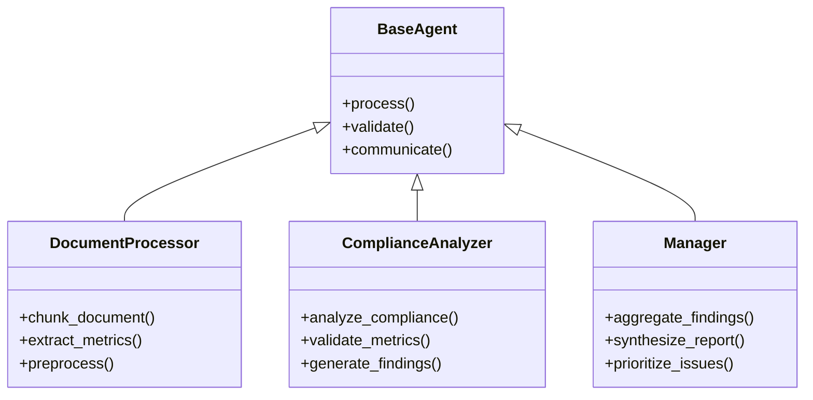
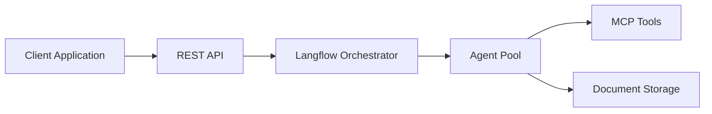

# IFRS Document Analysis Framework Architecture

## Overview

The IFRS Document Analysis Framework is designed to analyze financial documents for IFRS compliance using a Chain of Agents (CoA) architecture. The system processes financial statements and related documents through multiple specialized agents that work collaboratively to assess compliance and generate detailed reports.

## System Architecture

## Agent Responsibilities

### 1. Document Processor Agent
- Segments financial documents into logical chunks
- Extracts key financial metrics and statements
- Identifies document structure and relationships
- Preprocesses text for compliance analysis

### 2. Compliance Analyzer Agent
- Evaluates IFRS compliance rules
- Performs deep analysis of financial metrics
- Identifies potential compliance issues
- Generates detailed compliance findings

### 3. Manager Agent
- Aggregates findings from analyzer agents
- Synthesizes final compliance assessment
- Generates comprehensive reports
- Prioritizes compliance issues

## Data Flow

## Component Architecture

## Technology Stack

### Core Components
- **Langflow**: Visual pipeline construction and orchestration
- **Langchain**: Agent coordination and communication
- **Pydantic**: Data validation and schema enforcement
- **MCP Servers**: Tool integration and execution

### Integration Points
1. **Document Processing**
   - PDF parsing
   - Table extraction
   - Text normalization

2. **IFRS Rule Engine**
   - Rule definitions
   - Compliance checks
   - Metric validation

3. **Reporting System**
   - Report templates
   - Visualization
   - Export capabilities

## Deployment Architecture

## Security and Compliance

1. **Data Security**
   - Encryption at rest and in transit
   - Access control and authentication
   - Audit logging

2. **Compliance Requirements**
   - GDPR compliance
   - Data retention policies
   - Audit trail maintenance

## Performance Considerations

1. **Scalability**
   - Horizontal scaling of agent pools
   - Document processing optimization
   - Caching strategies

2. **Monitoring**
   - Agent performance metrics
   - Processing time tracking
   - Error rate monitoring

## Future Extensions

1. **AI Capabilities**
   - Advanced NLP models
   - Pattern recognition
   - Automated learning

2. **Integration Options**
   - ERP systems
   - Accounting software
   - Regulatory reporting systems
