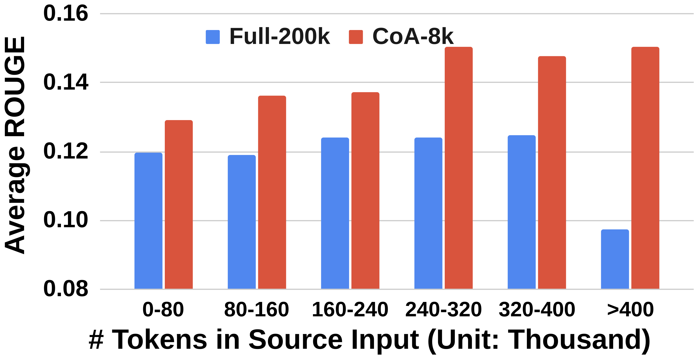
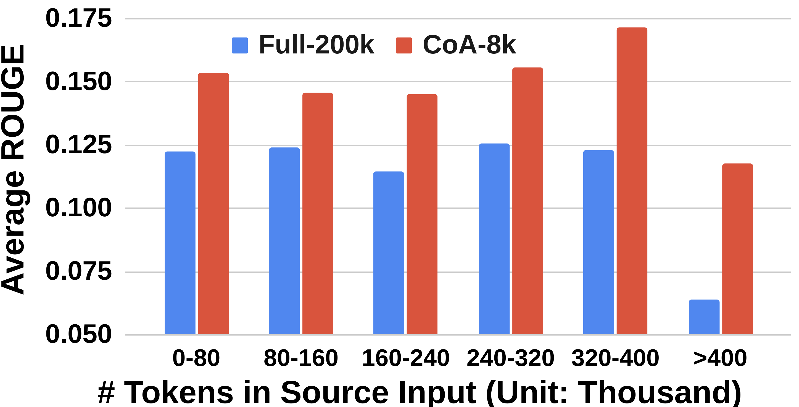
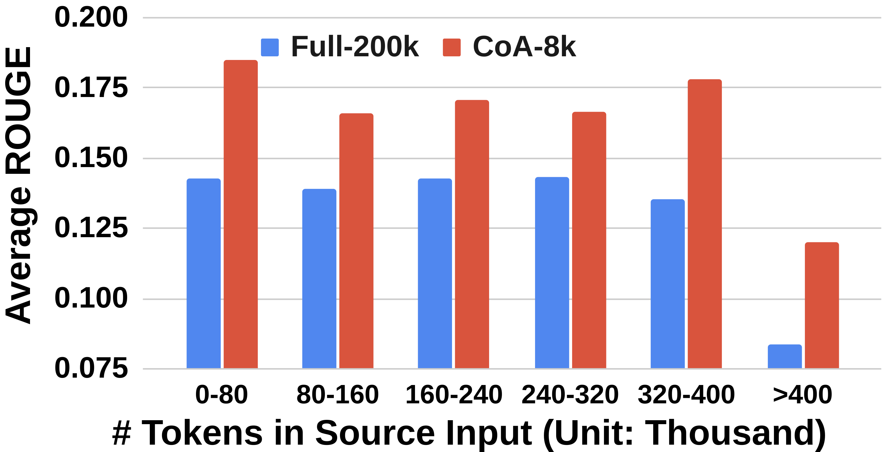
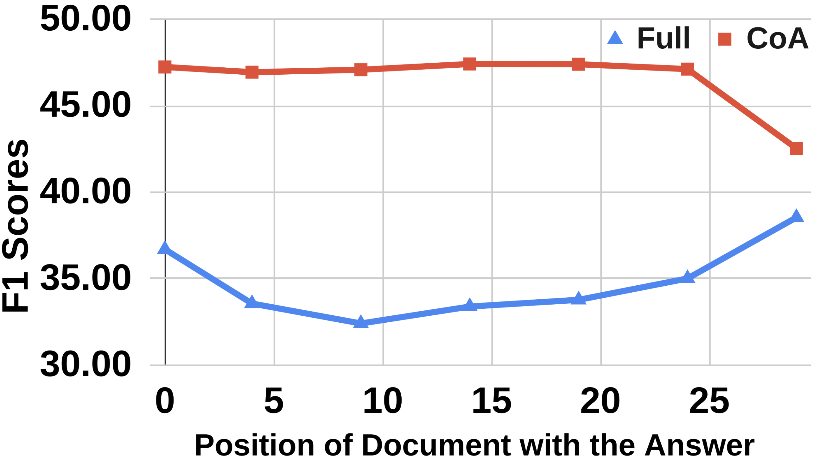
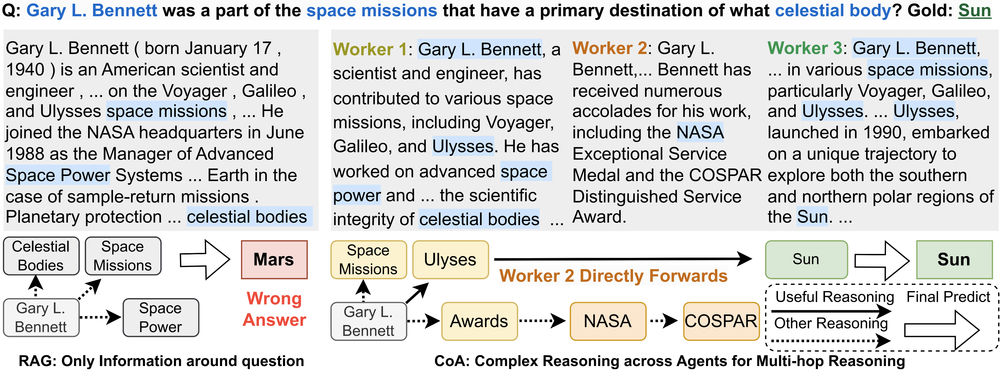
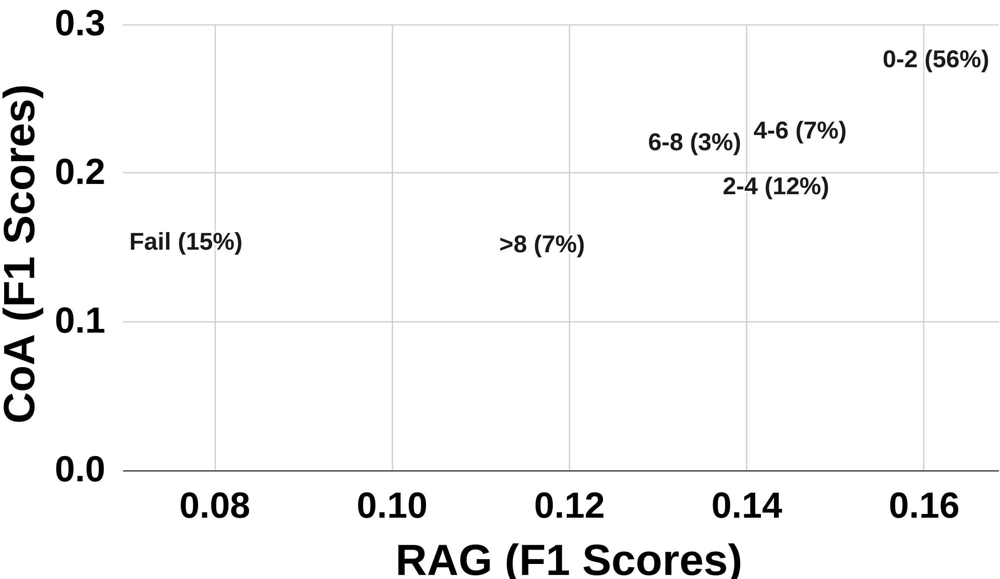
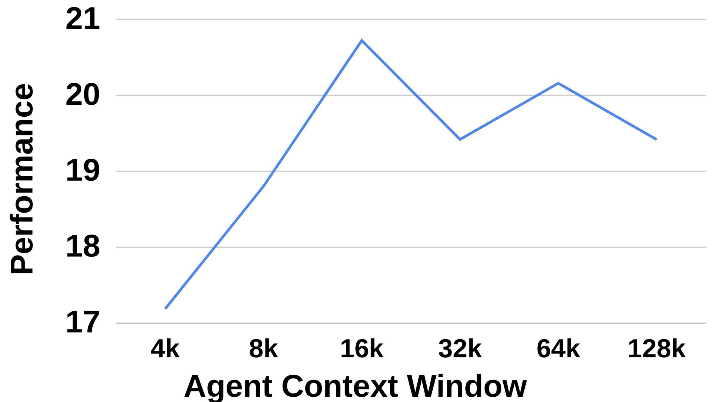
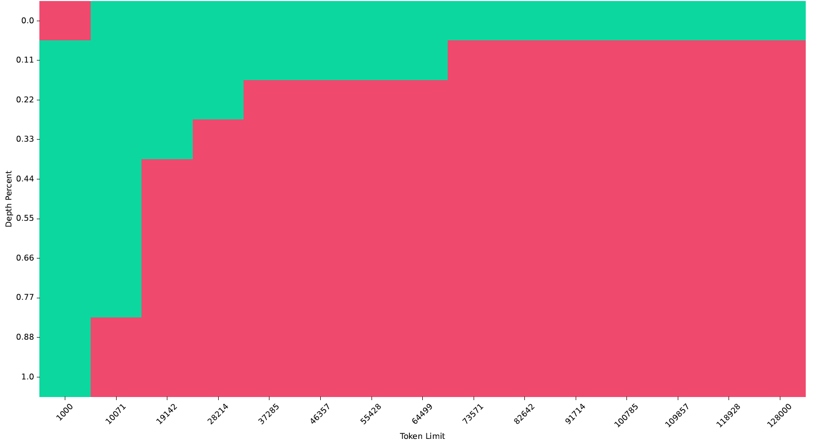

# 

## Authors

## Abstract

## Introduction
Subjects
Question: Does the paper describe potential risks incurred by study participants, whether such risks were disclosed to the subjects, and whether Institutional Review Board (IRB)
approvals (or an equivalent approval/review based on the requirements of your country or institution) were obtained?
Answer: [NA]
Justification: Our research does not involve crowdsourcing nor research with human subjects.
Guidelines:
•The answer NA means that the paper does not involve crowdsourcing nor research with human subjects.
•Depending on the country in which research is conducted, IRB approval (or equivalent)
may be required for any human subjects research. If you obtained IRB approval, you should clearly state this in the paper.
•We recognize that the procedures for this may vary significantly between institutions and locations, and we expect authors to adhere to the NeurIPS Code of Ethics and the guidelines for their institution.
•For initial submissions, do not include any information that would break anonymity (if applicable), such as the institution conducting the review.
30

## Methodology

## Experiments
Question: For each experiment, does the paper provide sufficient information on the computer resources (type of compute workers, memory, time of execution) needed to reproduce the experiments?
Answer: [Yes]
Justification: We conduct time complexity anlaysis to show the computer resources needed.
Also, we state each of the API call clearly so that the resource information can be easily accessed.
Guidelines:
• The answer NA means that the paper does not include experiments.
•The paper should indicate the type of compute workers CPU or GPU, internal cluster,
or cloud provider, including relevant memory and storage.
•The paper should provide the amount of compute required for each of the individual experimental runs as well as estimate the total compute.
•The paper should disclose whether the full research project required more compute than the experiments reported in the paper (e.g., preliminary or failed experiments that didn’t make it into the paper).
27

## Results
Question Answering. Table 4 shows the results of Question Answering tasks on all three models.
CoA (8k) outperforms Vanilla (8k) by a large margin on all 8 datasets , including 13.30% on
NarrativeQA, 12.82% on MuSiQue, and 22.00% on Quality, for text-bison, text-unicorn, and geminiultra, respectively. Also, CoA (8k) outperforms RAG (8k) model for all 8 datasets using all three
LLMs, demonstrating that CoA achieves higher performance than RAG. In other words, using multiagent LLMs outperforms RAG models . It is also worth noting that for gemini-ultra, Vanilla (32k)
improves the Vanilla (8k) baseline, yet it is still lower than CoA (8k). CoA also obtains compatible performance with with state-of-the-art models (Appendix E), while keeping robustness of window size (Appendix F.2).
Summarization and Code Completion. Table 4 shows the results of Summarization and Code
Completion tasks. Similarly, CoA (8k) also outperforms all Vanilla (8k) and (32k) baselines on all three datasets, demonstrating the strong capability of CoA on various tasks. It is worth noting that for
GovReport, RAG fails to improve the baseline with pseudo query. By contrast, CoA improves the performance significantly, showing that CoA can also be applied in non-query tasks (Appendix F.1).
Long Context LLMs. As Claude 3 models support 200k of tokens, we call these models long context models (LCM). Table 5 shows the performance of the LCM on two datasets. As can be seen,
CoA (8k) outperforms Vanilla (200k) significantly, showing that with only an 8k context window,
CoA achieves a much higher performance than LCM with a 200k context window . Also, CoA
improves the performance with the samples that can be fed into a 200k context window (no truncation).
Moreover, the improvements over the Vanilla (200k) and RAG (8k) become higher when the model
6
Table 5: Comparison with long context LLMs on NarrativeQA and BookSum. CoA significantly outperforms Claude 3 with 200k context limits. No Trun./Trun. indicates the source text in the sample is less/more than 200k tokens which does not need/needs truncation for vanilla (200k) baseline.
Average is the mean value across all samples.
claude-3-haiku claude-3-sonnet claude-3-opus
No Trun. Trun. Average No Trun. Trun. Average No Trun. Trun. Average
NarrativeQA
Vanilla (200k) 8.00 2.50 7.17 5.58 2.44 5.15 7.23 2.35 6.56
RAG (8k) 5.94 4.22 5.71 9.09 5.17 8.50 6.13 4.29 5.86
CoA (8k) 18.31 21.34 18.80 16.63 16.47 16.51 24.38 21.26 23.96
BookSum
Vanilla (200k) 11.98 11.70 12.04 12.17 11.90 12.10 14.11 13.67 14.00
CoA (8k) 13.28 13.73 13.70 14.92 15.05 14.96 17.74 16.68 17.47
Table 6: Comparison between CoA and other multi-agent frameworks. CoA with sequential agents outperforms other designs with multiple parallel agents including Merge and Hierarchical.
HotpotQA MuSiQue NarrativeQA Qasper QuALITY QMSum GovReport RepoBench-P
Vanilla (8k) 45.57 26.87 11.96 26.56 61.86 15.45 20.60 56.30
Merge (8k) 42.96 26.66 11.27 26.78 59.30 9.42 25.38 33.66
Hierarchical (8k) 50.62 29.40 17.04 31.39 64.20 15.19 16.54 27.96
CoA (8k) 53.62 37.09 25.26 37.17 65.42 16.77 26.11 58.25
size increases from Haiku to Opus (11.63/11.36/17.4 for NarrativeQA, 1.66/2.86/3.47 for BookSum).
This demonstrates that CoA benefits from stronger models to achieve higher improvements .
Other Multi-Agent Frameworks. As shown in Table 6, Hierarchical (8k) outperforms Vanilla (8k)
on five out of eight datasets, demonstrating the hierarchical approach can also improve the vanilla baselines significantly. Merge (8k) is lower than Vanilla (8k) except for GovReport, showing that merging is especially effective for long summarization tasks such as GovReport. As can be seen, CoA
outperforms Hierarchical and Merge on all eight datasets. The reason behind the results is because
Hierarchical and Merge do not allow workers to communicate with each other due to their parallel designs. Thus, each worker can only maintain the information in its own chunk ciwhich blocks the understanding of the whole text, hurting the performance greatly.
5 Analyses

## Discussion

## Conclusion

## References

## Figures

### Figure 1

### Figure 2

### Figure 3

### Figure 4

### Figure 5

### Figure 6

### Figure 7

### Figure 8

### Figure 9

### Figure 10

### Figure 11

