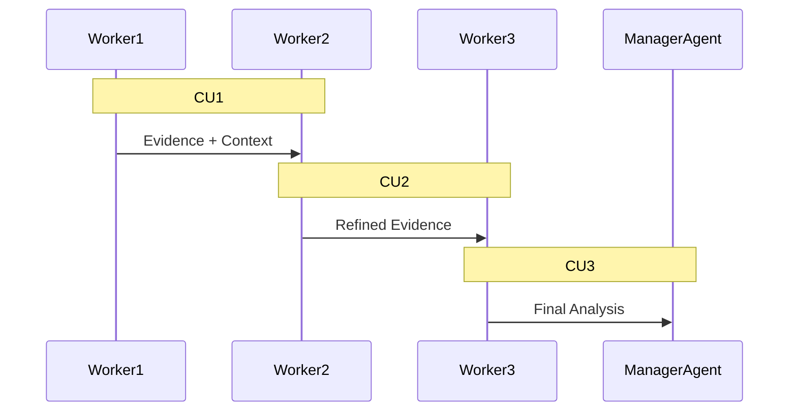
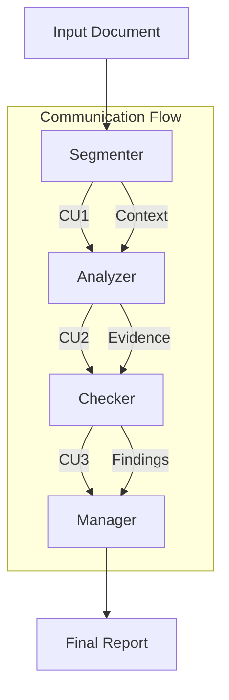
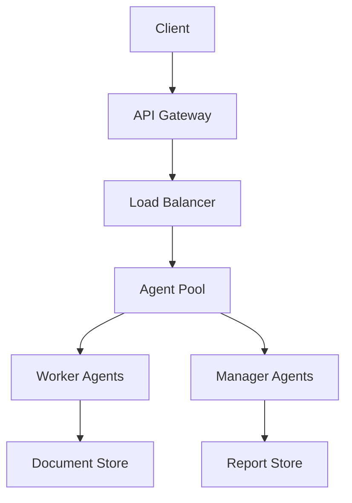

# Chain of Agents Technical Design for IFRS Analysis

## System Overview

The IFRS Analysis Chain of Agents (CoA) implementation follows the architecture described in the research paper, specifically adapted for financial document analysis. The system processes long financial documents through a chain of specialized agents that collaborate through natural language communication.

## Core Components

### 1. Communication Units (CU)



#### Communication Unit Structure
```python
class CommunicationUnit:
    source_segment: str       # Current document segment
    previous_evidence: str    # Evidence from previous agents
    current_findings: str     # New findings from current agent
    metadata: Dict           # Segment metadata and context
```

### 2. Worker Agents

Each worker agent specializes in specific aspects of IFRS analysis:

#### Document Segmenter Agent
- Splits documents into logical IFRS sections
- Identifies key financial metrics
- Maintains document structure context

#### Statement Analyzer Agent
- Analyzes financial statements
- Extracts compliance-related information
- Validates financial calculations

#### Compliance Checker Agent
- Evaluates IFRS rule compliance
- Identifies potential violations
- Generates compliance evidence

### 3. Manager Agent

The manager agent performs:
1. Evidence Synthesis
2. Conflict Resolution
3. Final Report Generation

## Implementation Details

### 1. Chain Communication Protocol



### 2. Agent Processing Steps

#### Worker Agent Processing
1. Receive input segment and previous CU
2. Process current segment
3. Integrate with previous evidence
4. Generate new CU for next agent

#### Manager Agent Processing
1. Collect all CUs
2. Synthesize evidence
3. Resolve conflicts
4. Generate final report

### 3. IFRS-Specific Adaptations

#### Document Structure Analysis
```python
class IFRSSection:
    section_type: str        # Balance Sheet, Income Statement, etc.
    metrics: Dict[str, Any]  # Financial metrics
    requirements: List[str]  # Applicable IFRS requirements
```

#### Compliance Rules Engine
```python
class ComplianceRule:
    rule_id: str
    standard: str           # IFRS standard number
    requirements: List[str]
    validation_func: Callable
```

## Performance Optimizations

### 1. Parallel Processing
- Segment preprocessing
- Independent rule validation
- Concurrent evidence gathering

### 2. Context Management
- Efficient segment handoff
- Relevant context preservation
- Memory optimization

## Error Handling

### 1. Catastrophic Collapse Prevention
Based on the paper's findings, we implement:
1. Response validation
2. Context preservation checks
3. Recovery mechanisms

### 2. Quality Assurance
- Evidence validation
- Cross-reference checking
- Consistency verification

## Monitoring and Evaluation

### 1. Performance Metrics
- Processing time per segment
- Evidence quality scores
- Compliance accuracy rates

### 2. System Health
- Agent response times
- Communication success rates
- Error frequency tracking

## Integration Points

### 1. External Systems
- Document management systems
- Financial databases
- Regulatory reporting systems

### 2. API Interfaces
```python
class IFRSAnalysisAPI:
    async def analyze_document(self, doc: bytes) -> Report
    async def validate_compliance(self, statements: Dict) -> Results
    async def generate_report(self, findings: List[Finding]) -> Report
```

## Deployment Architecture



## Security Considerations

### 1. Data Protection
- Encryption at rest
- Secure communication
- Access control

### 2. Compliance
- Audit logging
- Version control
- Data retention

## Future Extensions

### 1. Enhanced Capabilities
- Multi-standard support
- Real-time analysis
- Automated corrections

### 2. Integration Options
- Cloud deployment
- Enterprise systems
- Regulatory platforms

## Implementation Roadmap

### Phase 1: Core Framework
1. Basic agent implementation
2. Communication protocol
3. IFRS rule engine

### Phase 2: Advanced Features
1. Parallel processing
2. Enhanced error handling
3. Performance optimization

### Phase 3: Enterprise Integration
1. API development
2. Security hardening
3. Monitoring system
